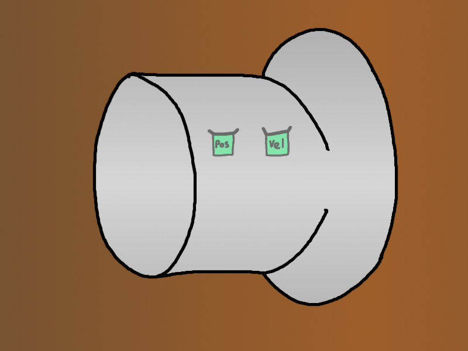
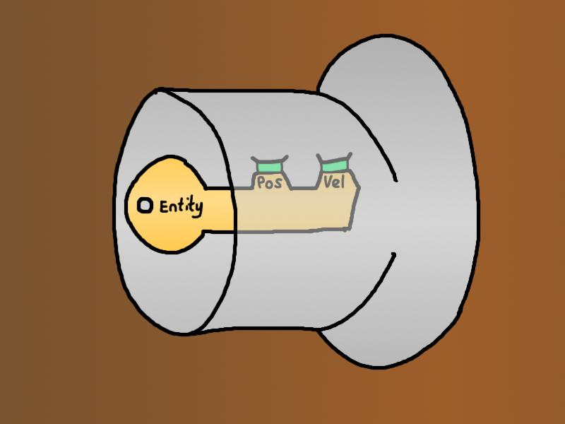
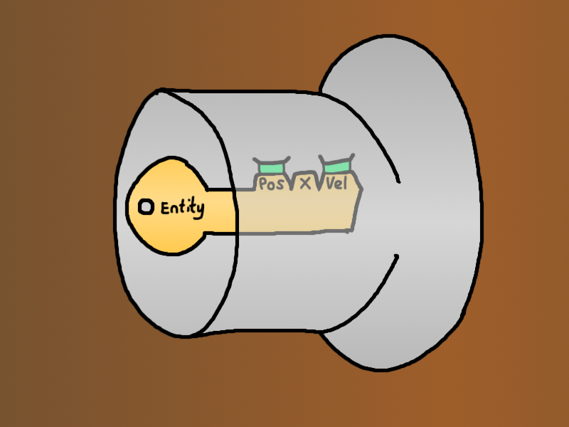
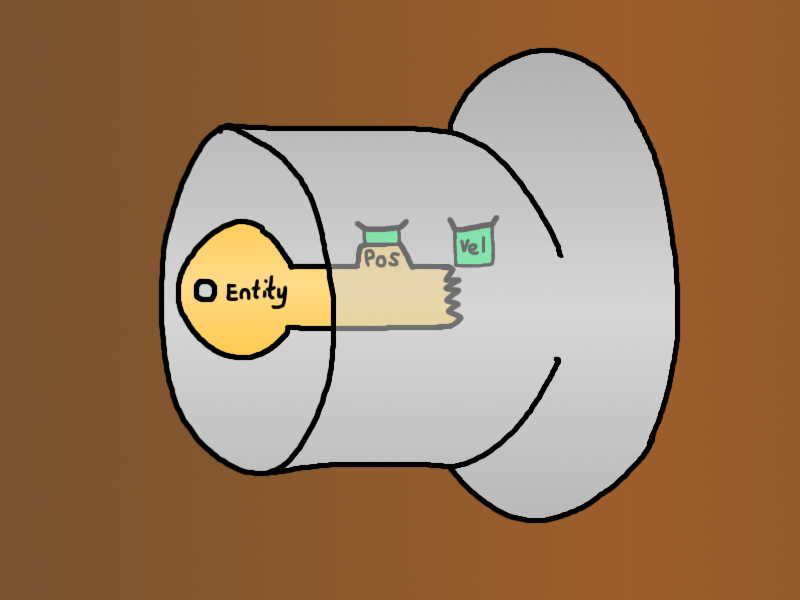
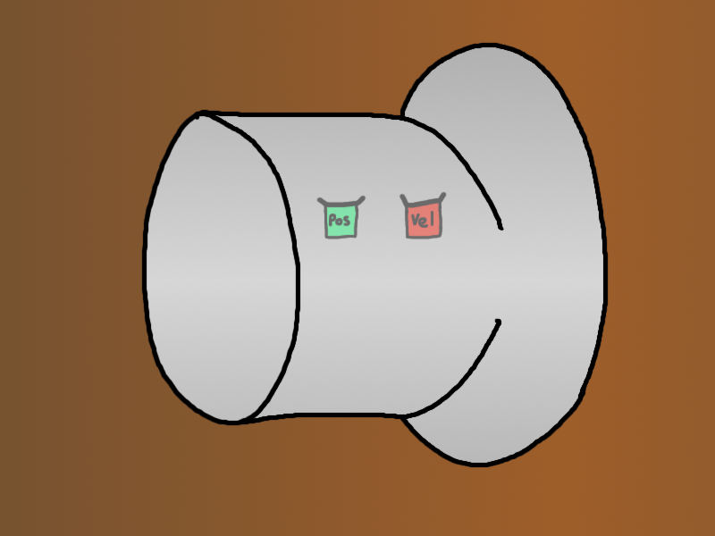
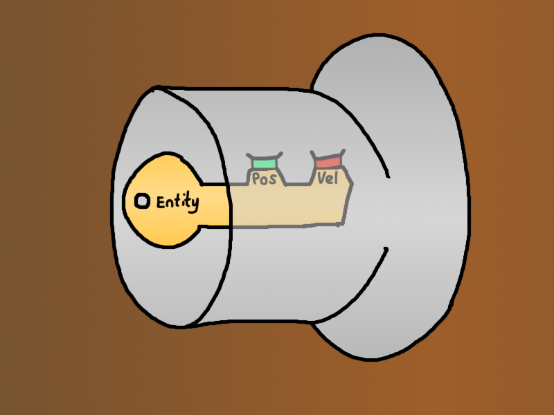

## ECS: A Programming Paradigm

Azriel Hoh

---

### About

* **Before:** Automated distributed system management.
* **Now:** Making a Rust game.

+++

### Agenda

1. Data Organisation
    - OO: Array of Structs
    - EC: Struct of Arrays
2. Game Scenario
3. Patterns
    - Generational Arena
    - Storages
4. Logic
    - MVC
    - Systems
    - Dispatcher
5. Summary
    - Trade-offs

---

### Data: OO

+++

### Data: OO

We usually define data types hierarchically:


<!-- https://github.com/gitpitch/gitpitch/issues/95 -->

+++

### Data: OO

In code, that looks something like this:

```rust
struct Person {
    contact_details: ContactDetails,
    date_of_birth: DateTime<Utc>,
}

struct ContactDetails { /* fields */ }
struct DateTime<Tz> { /* fields */ }
```

+++

### Data: OO

A list of people can be stored like this:

```rust
struct World {
    people: Vec<Person>,
}
```

This layout is:

* Hierarchical.
* Coined *arrays of structs* (AOS).

---

### Data: Struct of Arrays

+++

### Data: Struct of Arrays

Split `Person` into parts, keep the same parts together:

```rust
struct World {
    contact_details: Vec<ContactDetails>,
    date_of_births: Vec<DateTime<Utc>>,
}
```

Each index into the `Vec<_>`s represents a person.

Need to make sure `Vec<_>`s have the same length.

+++

### Data: Struct of Arrays

In picture form:


<!-- https://github.com/gitpitch/gitpitch/issues/95 -->

A `Person` is a vertical slice from both `Vec<_>`s.

`Person` no longer exists, it's now an abstract concept.

+++

### Data: Struct of Arrays


Why would anyone want to do that?

---

### Calculate Average Age

+++

### Calculate Average Age

Formula:

```rust
average_age = total_age / number_of_people
```

+++

### Calculate Average Age

```rust
struct Person {
    contact_details: ContactDetails,
    date_of_birth: DateTime<Utc>,
}

let people: Vec<Person> = /* ... */;
let now = Utc::now();

let mean_age = people
    .iter()
    // Sum everyone's age
    .fold(0., |sum, p| sum + years_since(p.date_of_birth, now))
    // Divide by number of people
    / people.len() as f32
```

+++

### Memory Access

Here is the data that we iterate over:

<table style="font-size: 0.6em;">
    <tr><td rowspan="3">P0</td><td rowspan="2" bgcolor="#eecc99">Contact Details</td><td bgcolor="#eecc99">Address</td></tr>
    <tr><td bgcolor="#eecc99">Phone Number</td></tr>
    <tr><td bgcolor="#eecc99">Date of Birth</td></tr>

    <tr><td rowspan="3">P1</td><td rowspan="2" bgcolor="#eecc99">Contact Details</td><td bgcolor="#eecc99">Address</td></tr>
    <tr><td bgcolor="#eecc99">Phone Number</td></tr>
    <tr><td bgcolor="#eecc99">Date of Birth</td></tr>

    <tr><td rowspan="3">P2</td><td rowspan="2" bgcolor="#eecc99">Contact Details</td><td bgcolor="#eecc99">Address</td></tr>
    <tr><td bgcolor="#eecc99">Phone Number</td></tr>
    <tr><td bgcolor="#eecc99">Date of Birth</td></tr>

    <tr><td rowspan="3">P3</td><td rowspan="2" bgcolor="#eecc99">Contact Details</td><td bgcolor="#eecc99">Address</td></tr>
    <tr><td bgcolor="#eecc99">Phone Number</td></tr>
    <tr><td bgcolor="#eecc99">Date of Birth</td></tr>
</table>

+++

### Memory Access

Here is the data that we need:

<table style="font-size: 0.6em;">
    <tr><td rowspan="3">P0</td><td rowspan="2" bgcolor="#eecc99">Contact Details</td><td bgcolor="#eecc99">Address</td></tr>
    <tr><td bgcolor="#eecc99">Phone Number</td></tr>
    <tr><td bgcolor="#aaccff">Date of Birth</td></tr>

    <tr><td rowspan="3">P1</td><td rowspan="2" bgcolor="#eecc99">Contact Details</td><td bgcolor="#eecc99">Address</td></tr>
    <tr><td bgcolor="#eecc99">Phone Number</td></tr>
    <tr><td bgcolor="#aaccff">Date of Birth</td></tr>

    <tr><td rowspan="3">P2</td><td rowspan="2" bgcolor="#eecc99">Contact Details</td><td bgcolor="#eecc99">Address</td></tr>
    <tr><td bgcolor="#eecc99">Phone Number</td></tr>
    <tr><td bgcolor="#aaccff">Date of Birth</td></tr>

    <tr><td rowspan="3">P3</td><td rowspan="2" bgcolor="#eecc99">Contact Details</td><td bgcolor="#eecc99">Address</td></tr>
    <tr><td bgcolor="#eecc99">Phone Number</td></tr>
    <tr><td bgcolor="#aaccff">Date of Birth</td></tr>
</table>

---

### Calculate Average Age: SOA

```rust
let contact_details: Vec<ContactDetails> = /* ... */;
let date_of_births: Vec<DateTime> = /* ...  */;
let world = World { contact_details, date_of_births };

let now = Utc::now();

// Note: we don't actually read `contact_details`.
let mean_age = world
    .date_of_births
    .iter()
    // Sum everyone's age
    .fold(0., |sum, dob| sum + years_since(*dob, now))
    // Divide by number of people
    / world.date_of_births.len() as f32
```

+++

### Memory Access: SOA

Here is the data that we iterate over:

<table style="font-size: 0.6em;">
    <tr><td>D0</td><td bgcolor="#eecc99">Date of Birth</td></tr>
    <tr><td>D1</td><td bgcolor="#eecc99">Date of Birth</td></tr>
    <tr><td>D2</td><td bgcolor="#eecc99">Date of Birth</td></tr>
    <tr><td>D3</td><td bgcolor="#eecc99">Date of Birth</td></tr>
</table>

+++

### Memory Access: SOA

Here is the data that we need:

<table style="font-size: 0.6em;">
    <tr><td>D0</td><td bgcolor="#aaccff">Date of Birth</td></tr>
    <tr><td>D1</td><td bgcolor="#aaccff">Date of Birth</td></tr>
    <tr><td>D2</td><td bgcolor="#aaccff">Date of Birth</td></tr>
    <tr><td>D3</td><td bgcolor="#aaccff">Date of Birth</td></tr>
</table>

+++

### Memory Access: SOA

Should I care?

---

### Data Locality

+++

### Data Locality

When you fetch data, the computer thinks:

**Maybe I should fetch more!**


+++

### Data Locality

<table style="font-size: 0.6em;">
<tr><td></td><td>Hierarchical</td><td></td><td>SOA</td></tr>
<tr><td rowspan="10">Cache<br />Capacity</td><td rowspan="2">P0</td><td rowspan="10"></td><td>DateTime0</td></tr>
<tr><td>DateTime1</td></tr>
<tr><td rowspan="2">P1</td><td>DateTime2</td></tr>
<tr><td>DateTime3</td></tr>
<tr><td rowspan="2">P2</td><td>DateTime4</td></tr>
<tr><td>DateTime5</td></tr>
<tr><td rowspan="2">P3</td><td>DateTime6</td></tr>
<tr><td>DateTime7</td></tr>
<tr><td rowspan="2">P4</td><td>DateTime8</td></tr>
<tr><td>DateTime9</td></tr>
</table>

---

### Benchmark: AOS vs SOA

 [azriel91/aos_vs_soa/lib.rs#L112-L117](https://github.com/azriel91/aos_vs_soa/blob/master/src/lib.rs#L112-L117)

```bash
git clone git@github.com:azriel91/aos_vs_soa.git
cd aos_vs_soa
cargo bench
```

+++

### Benchmark: AOS vs SOA

Sample output:

```bash
running 2 tests
test tests::array_of_structs::avg_age ... bench:   2,427,309 ns/iter (+/- 201,343)
test tests::struct_of_arrays::avg_age ... bench:   2,192,988 ns/iter (+/- 136,117)

test result: ok. 0 passed; 0 failed; 0 ignored; 2 measured; 0 filtered out
```

+++

### Benchmark: AOS vs SOA

```
name       aos ns/iter  soa ns/iter  diff ns/iter  diff %  speedup
::avg_age  2,427,309    2,192,988        -234,321  -9.65%   x 1.11
::avg_age  2,438,766    2,215,783        -222,983  -9.14%   x 1.10
::avg_age  2,444,267    2,196,445        -247,822 -10.14%   x 1.11
::avg_age  2,430,973    2,195,141        -235,832  -9.70%   x 1.11
::avg_age  2,462,707    2,185,442        -277,265 -11.26%   x 1.13
::avg_age  2,414,035    2,211,378        -202,657  -8.39%   x 1.09
::avg_age  2,431,339    2,219,773        -211,566  -8.70%   x 1.10
::avg_age  2,433,808    2,225,186        -208,622  -8.57%   x 1.09
::avg_age  2,404,514    2,175,141        -229,373  -9.54%   x 1.11
::avg_age  2,409,768    2,200,761        -209,007  -8.67%   x 1.09
```

---

### Breather

---

### Scenario: Game

+++

### Scenario: Game

**Disclaimer**

> These examples are based on the `specs` crate. There
> are many other ECS implementations, whether in Rust or
> other languages.

+++

### Scenario: Game

<table>
<tr>
    <td>
        <b>Player</b><br/>
        <ul>
            <li>Render</li>
            <li>Position</li>
            <li>Velocity</li>
            <li>Input</li>
        </ul>
    </td>
    <td>
        <b>Monster</b><br/>
        <ul>
            <li>Render</li>
            <li>Position</li>
            <li>Velocity</li>
        </ul>
    </td>
</tr>
<tr>
    <td>
        <b>Speech Bubble</b><br/>
        <ul>
            <li>Render</li>
            <li>Input</li>
        </ul>
    </td>
    <td>
        <b>Map</b><br/>
        <ul>
            <li>Render</li>
            <li>Bounds</li>
        </ul>
    </td>
</tr>
</table>

+++

### OO Model

* **G**ood **O**bject **O**riented **D**esign (GOOD)
    - Interface inheritance
    - Composition
* **O**bject **O**riented **P**rogramming **S**yntax (OOPS)
    - Implementation inheritance

+++

### OO Model


<!-- https://github.com/gitpitch/gitpitch/issues/95 -->

+++

### OO Model

In code:

```rust
trait Renderable {}
trait Positionable {}
trait Movable {}
trait InputControlled {}

struct Player;
impl Renderable for Player {}
impl Positionable for Player {}
impl Movable for Player {}
impl InputControlled for Player {}

struct Monster;
impl Renderable for Monster {}
impl Positionable for Monster {}
impl Movable for Monster {}

struct World {
    players: Vec<Player>,
    monsters: Vec<Monster>,
}
```

+++

### OO Model

Problems:

* Development overhead for common logic.
* Borrowing parts of an object.
    - `Arc<Mutex<_>>`
    - `Copy` / `Clone`
    - Deconstruct / Reconstruct
    - "View" structs

---

### EC Model

Some `Component`s only apply to some entities.


<!-- https://github.com/gitpitch/gitpitch/issues/95 -->

+++

### EC Model

In code, components can be represented like this:

```rust
struct World {
    // Note: Can't simply store traits like this,
    // In this example, components must be concrete types
    renderables: Vec<Option<Renderable>>,
    positions: Vec<Option<Position>>,
    velocities: Vec<Option<Velocity>>,
    inputs: Vec<Option<Input>>,
    bounds: Vec<Option<Bound>>,

    // How to track each type of entity? `usize`!
    players: Vec<usize>,
    monsters: Vec<usize>,
    speech_bubbles: Vec<usize>,
    maps: Vec<usize>,
}
```

+++

### EC Model

Problem?

+++

### EC Model

More like, problems!

* **Memory bloat:** Unused slots.
* **Entity creation:** Finding a free index.
    - **Overflow:** What if we run out of indices?
* **Entity deletion:**
    - **Mutable access:** Remove components from all storages.
    - **Can we delete:** Is anyone referencing this entity?

---

### Breather

---

### Generational Arena

+++

### Generational Arena

Arena? The Colosseum!


+++

### Generational Arena

**Arena:** Request a chunk of memory, and manage it yourself.

**Generational:** Use a *generational index* to track free space in the arena.

+++

### Generational Arena

Instead of referencing an entity by `usize`, use:

```rust
#[derive(Eq, PartialEq, ..)]
pub struct GenerationalIndex {
    index: usize,
    generation: u64,
}
```

If the generation does not match, it's a different entity.  
Note: *index* type is twice as big, but generally smaller than `Component`

+++

### Generational Arena

Key concepts:

* Keep a pool of memory, remember which slots are "empty"
* Track a generation number used when inserting data.
* When freeing a slot, ensure the generation is at least one more than the generation of the freed slot.

+++

### Generational Arena

Instead of:

* `Vec<T>` where `T` is the stored component
* An incrementing `usize` to track next free index

Use `Vec<Entry<T>>`, where `Entry` is:

```rust
enum Entry<T> {
    Free { next_free: Option<usize> },
    Occupied { generation: u64, value: T },
}
```

+++

### Generational Arena


+++

### Generational Arena


+++

### Generational Arena


+++

### Generational Arena

Solves:

* **Memory bloat:** ❌ Unused slots.
* **Entity creation:** Finding a free index.
    - ✔️ **Overflow:** Reuse existing indicies
* **Entity deletion:**
    - ✔️ **Mutable access:** Old gen signals absence.
    - ⭕ **Can we delete:** Old gen signals absence.

---

### EC Storages

+++

### EC Storages

`VecStorage` can be a waste of memory:


<!-- https://github.com/gitpitch/gitpitch/issues/95 -->

+++

### EC Storages

`Vec` is optimal for frequent components:


<!-- https://github.com/gitpitch/gitpitch/issues/95 -->

+++

### EC Storages

A lookup `Vec` saves memory for common components:


<!-- https://github.com/gitpitch/gitpitch/issues/95 -->

+++

### EC Storages

Rare components can be stored using a `HashMap`:


<!-- https://github.com/gitpitch/gitpitch/issues/95 -->

+++

### EC Storages

Solves:

* **Memory bloat:** ✔️ Unused slots.
* **Entity creation:** Finding a free index.
    - ✔️ **Overflow:** Reuse existing indicies
* **Entity deletion:**
    - ✔️ **Mutable access:** Old gen signals absence.
    - ⭕ **Can we delete:** Old gen signals absence.

---

### Breather

---

### Logic

+++

### Task: Update Positions

`Player`s and `Monster`s have a position and velocity.

Write a function to update position based on velocity.

```rust
position += velocity
```

+++

### Logic: OO

> Write the `update` function inside the `class`.  
> Hiding the code means better encapsulation.
>
> &ndash; every CS course *(how we heard it)*

+++

### Logic: OOPS

How to increase software maintenance costs:

```rust
impl PositionUpdate for Player {
    fn update(&mut self) {
        self.pos += self.vel;
    }
}

impl PositionUpdate for Monster {
    fn update(&mut self) {
        self.pos += self.vel;
    }
}
```

+++

### Logic: GOOD (MVC)

```rust
type Kinematic = i32;
impl Positionable for Player { fn pos_mut(&mut self) -> &mut Kinematic { &mut self.pos } }
impl Positionable for Monster { fn pos_mut(&mut self) -> &mut Kinematic { &mut self.pos } }
impl Movable for Player { fn vel(&self) -> &Kinematic { &self.vel } }
impl Movable for Monster { fn vel(&self) -> &Kinematic { &self.vel } }

trait GameObject: Positionable + Movable {}

fn position_update(game_objects: &mut [Box<GameObject>]) {
    for i in 0..game_objects.len() {
        let vel = game_objects[i].vel();
        *game_objects[i].pos_mut() += *vel;
    }
}
```

 [playpen](https://play.rust-lang.org/?version=stable&mode=debug&edition=2015&gist=f8e4a16d89d4bdd80d12095c837e5cc1)

+++

### Logic: GOOD (MVC)

* Logic is generally pretty clean.
* Difficult to update objects due to borrowing rules.

    Choose from:

    - `Arc<Mutex<_>>`
    - View structs &ndash; `&field`.
    - Deconstruct, reconstruct.
    - ...

---

### Systems

+++

### Systems

The **S** in **ECS**.

+++

### Lock & Key Analogy

Given this lock:



+++

### Lock & Key Analogy

This key works:



+++

### Lock & Key Analogy

So does this:



+++

### Lock & Key Analogy

But not this:



+++

### Lock & Key Analogy

For this lock:



+++

### Lock & Key Analogy

This key works:


+++

### Lock & Key Analogy

But not this:



---

### Systems

Remember this:


<!-- https://github.com/gitpitch/gitpitch/issues/95 -->

+++

### Systems

```rust
// Whitelist components (must haves)
(&renderables, &positions).join() -> [(R0, P0), (R1, P1)] // player, monster
```


<!-- https://github.com/gitpitch/gitpitch/issues/95 -->

+++

### Systems

```rust
// Exclude / blacklist components
(&positions, !&inputs).join() -> [(P1, ())] // monster
```


<!-- https://github.com/gitpitch/gitpitch/issues/95 -->

+++

### Systems

Compare:

```rust
/// OO position_update():
for i in 0..game_objects.len() {
    *game_objects[i].pos_mut() += *game_objects[i].vel();
}

// PositionUpdateSystem run():
for (pos, vel) in (&mut positions, &velocities).join() {
    *pos += *vel;
}
```

---

### Breather

---

### System Data

+++

### System Data

Systems operate over data.  
We call that `SystemData`.

`SystemData` looks like this:

```rust
/// Systems operate on resources that are borrowed from the `World`.
/// This is the lifetime that those references live for.
///
/// => The resources must live for at least as long as `'s`.
type PositionUpdateSystemData<'s> = (
    WriteStorage<'s, Position>,
    ReadStorage<'s, Velocity>,
);
```

+++

### System Data

And is used like this:

```rust
struct PositionUpdateSystem;

type PositionUpdateSystemData<'s> = (
    WriteStorage<'s, Position>,
    ReadStorage<'s, Velocity>,
);

impl System<'s> for PositionUpdateSystem {
    type SystemData = PositionUpdateSystemData<'s>;

    fn run(&mut self, (mut positions, velocities): Self::SystemData) {
        // Here is the system logic!
        for (pos, vel) in (&mut positions, &velocities).join() {
            *pos += *vel;
        }
    }
}
```

---

### Dispatcher

+++

### Dispatcher

What it is:

* System graph
* Thread pool
* Execution
    - Parallel
    - Safe: multiple readers / exclusive writer

+++

### Dispatcher: System Graph


<!-- https://github.com/gitpitch/gitpitch/issues/95 -->

 [specs/examples/full.rs#L221-L230](https://github.com/slide-rs/specs/blob/b22955b6487b53c22117a77cd93ee2ad78e31711/examples/full.rs#L221-L230)

+++

### Dispatcher: Thread Pool


<!-- https://github.com/gitpitch/gitpitch/issues/95 -->

---

### Summary

* Compare GOOD with ECS, not OOPS with ECS
* It's a trade-off.

|     | OO  | EC  |
| --- | --- | --- |
| Logical partitioning                  | State | Behaviour |
| Visible concrete model                |  ✔️  |     |
| Optimized for cache usage<sup>1</sup> |       | ✔️ |
| Borrow-checker management<sup>2</sup> |       | ✔️ |

<sup>1</sup> Rust doesn't auto-vectorize floats well.  
<sup>2</sup> Ease of passing data for parallelization

---

### Questions, Answers and Comments

---

### Thanks!

* Catherine West / `@Kyrenite`: Learnt *a lot* from her blog.
* The `specs` team: Who have written such a great library.
* Maik Klein: For expanding my knowledge on auto-vectorization.
* `@medusacle`: For much feedback on improving these slides.

---

### Links

* @size[0.7em](Slides: https://github.com/azriel91/ecs_paradigm)
* @size[0.7em](RustConf 2018 Closing Keynote: https://www.youtube.com/watch?v=P9u8x13W7UE)
* @size[0.7em](`@Kyrenite`'s Blog: https://kyren.github.io/2018/09/14/rustconf-talk.html)
* @size[0.7em](`specs`: https://crates.io/crates/specs)
* @size[0.7em](`soa-derive`: https://github.com/lumol-org/soa-derive)
* @size[0.7em](Benchmark comparison: https://github.com/azriel91/aos_vs_soa)
* @size[0.7em](Component Graph System: https://github.com/kvark/froggy/wiki/Component-Graph-System)
