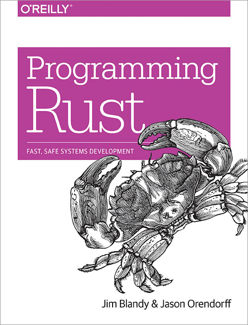
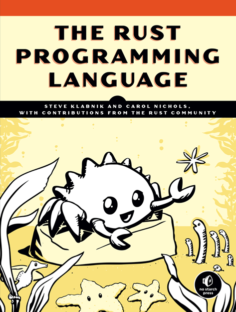

<div class="title">

# Introduction to Rust

### A gentle exploration of the language


</div>

-----------------

# Who's this guy?

<div style="float: left; padding-right: 1em; width: 25%">


</div>
<div style="margin-left: 25%">

### Sylvain Wallez - @bluxte

### Tech lead - Elastic Cloud

Previously tech lead, CTO, architect, trainer, developer...  
...at OVH, Actoboard, Sigfox, Scoop.it, Joost, Anyware

Member of the Apache Software Foundation since 2003

</div>

<center class="clear">

<br>We're hiring!

</center>

-----------------

# On the menu

- Where does Rust come from?
- Basics: functions, structures, methods
- Controlled mutability
- Ad hoc polymorphism with traits
- Memory management
- Controlled concurrency

----------------

# Rust

"Empowering everyone to build reliable and efficient software"

* Performance: blazingly fast and memory efficient.
* Reliability: rich type system & ownership model guarantee memory safety & thread safety.
* Productivity: great documentation, friendly compiler, awesome tooling.

----------------

# Rust

"Empowering everyone to build reliable and efficient software"

* Performance: blazingly fast and memory efficient.
* Reliability: rich type system & ownership model guarantee memory safety & thread safety.
* Productivity: great documentation, friendly compiler, awesome tooling.

<center>


</center>

----------------

# Learning Rust

<div style="float: left; width: 40%;">



</div>

<div style="float: right; width: 40%; text-align: center">



<small>Online at https://www.rust-lang.org/</small>

</div>

----------------

# Rust

* Started in 2006 at Mozilla, first announced in 2010
  * Primary goals: a fast and secure language
  * Parts of Firefox are written in Rust
  
* First stable release in 2015
  * New releases every 6 weeks, “edition 2018” released last December

* Who uses it?
  * AWS: Firecracker powers Lambda and Fargate
  * Google: parts of the Fuschia operating system
  * CloudFlare: quic / http 3 implementation
  * Dropbox: file storage
  * Clever Cloud: reverse proxy
  * Atlassian, Canonical, Coursera, Chef, Deliveroo, NPM, Sentry… 

-----------------

# The Rust ecosystem

<div style="float: left; width: 47%;">


</div>

<div style="float: right; width: 47%">

**crates.io – there’s a crate for that!**

Twitter: @rustlang, @ThisWeekInRust  
https://users.rust-lang.org  
https://exercism.io/

http://www.arewewebyet.org/  
http://arewegameyet.com/  
https://areweideyet.com/  
http://www.arewelearningyet.com/

</div>

--------------

# Getting started: rustup & cargo

## Rustup: the Rust toolchain manager

Manage versions, target OS and architectures

`curl https://sh.rustup.rs -sSf | sh` or download from https://rustup.rs/

`rustup doc --std` -- browse the docs locally!

## Cargo: the Rust build system

```
cargo new --bin rust_intro
cargo run
```

```
.
├── Cargo.toml
└── src
    └── main.rs
```
---------------

# Hello, Rust!

Cargo.toml

```
[package]
name = "rust_intro"
version = "0.1.0"
authors = ["Sylvain Wallez <sylvain@bluxte.net>"]
edition = "2018"

[dependencies]
```

main.rs

```rust,editable
fn main() {
    println!("Hello, world!");
}
```

---------------

# Variables & type inference

&nbsp;

```rust,editable
fn main() {
    let answer = 42;
    
    println!("Hello {}", answer);
    
    assert_eq!(answer,42);
}
```
---------------

# Control structures

&nbsp;

```rust,editable
fn main() {
    for i in 0..5 {
        if i % 2 == 0 {
            println!("{} is even", i);
        } else {
            println!("{} is odd", i);
        }
    }
}
```

---------------

# If as an expression

&nbsp;

```rust,editable
fn main() {
    for i in 0..5 {
        let even_odd = if i % 2 == 0 {"even"} else {"odd"};
        println!("{} is {}", i, even_odd);
    }
}
```

---------------

# Function declaration

Parameters and return types must be explicit

```rust,editable
fn is_even(i: i32) -> bool {
    i % 2 == 0
}

fn main() {
    for i in 0..5 {
        let even_odd = if is_even(i) {"even"} else {"odd"};
        println!("{} is {}", i, even_odd);
    }
}
```

---------------

# Immutability by default

&nbsp;

```rust,editable
fn main() {
    let mut sum = 0;
    for i in 0..5 {
        sum += i;
    }
    println!("sum is {}", sum);
}
```

---------------

# Functional iteration

&nbsp;

```rust,editable
fn is_even(i: i32) -> bool {
    i % 2 == 0
}

fn main() {
    let sum: i32 =
        (0..5)                   // this is an iterator
        .filter(|i| is_even(*i)) // filter with a closure
        .sum();                  // consume the iterator
        
    println!("sum of even numbers is {}", sum);
}
```

---------------

# Passing values by reference

&nbsp;

```rust,editable
fn is_even(i: &i32) -> bool {
    i % 2 == 0
}

fn main() {
    let sum: i32 =
        (0..5)                   // this is an iterator  
        .filter(|i| is_even(i))  // filter with a closure
        .sum();                  // consume the iterator
            
    println!("sum of even numbers is {}", sum);
}
```

---------------

# Mutable function parameters

&nbsp;

```rust,editable
fn modifies(x: &mut f64) {
    *x = 1.0;
}

fn main() {
    let mut result = 0.0;
    modifies(&mut result);
    println!("result is {}", result);
}
```

---------------

<div class="title">

# Vectors, enums, structures

</div>

---------------

# Vectors

&nbsp;

```rust,editable
fn main() {
    let mut v = Vec::new();
    v.push(10);
    v.push(20);
    v.push(30);

    let first = v[0];           // will panic if out-of-range
    let maybe_first = v.get(0); // returns an Option

    println!("v is {:?}", v);
    println!("first is {}", first);
    println!("maybe_first is {:?}", maybe_first);
}
```

---------------

# Some, None? The Option enum

&nbsp;

```rust,no_run
pub enum Option<T> {
    None,
    Some(T),
}
```

---------------

# Pattern matching

&nbsp;

```rust,editable
fn main() {
    let v = vec![10, 20, 30]; // initialization macro    
    let idx = 0;
    
    match v.get(idx) {
        Some(value) => println!("Value is {}", value),
        None => println!("No value..."),
    }
}
```

---------------

# Destructuring assigment

&nbsp;

```rust,editable
fn main() {
    let v = vec![10, 20, 30];    
    let idx = 0;
    
    if let Some(value) = v.get(idx) {
        println!("Value is {}", value);
    }
}
```

---------------

# More pattern matching

&nbsp;

```rust,editable
fn main() {
    let n = 0;
    let text = match n {
        0 => "zero",
        1 => "one",
        2 => "two",
        _ => "many",
    };

    println!("{} is {}", n, text);
}
```

---------------

# Tuples

&nbsp;

```rust,editable
fn add_mul(x: f64, y: f64) -> (f64, f64) {
    (x + y, x * y)
}

fn main() {
    let t = add_mul(2.0, 10.0);

    println!("tuple is {:?}", t);

    println!("add {} mul {}", t.0, t.1);

    let (add, mul) = t;
    println!("add {} mul {}", add, mul);
}
```

---------------

# Structs

&nbsp;

```rust,editable
struct Person {
    first_name: String,
    last_name: String
}

fn main() {
    let p = Person {
        first_name: "John".to_string(),
        last_name: "Smith".to_string()
    };
    println!("This is {} {}", p.first_name, p.last_name);
}
```

---------------

# Struct implementation

```rust,editable
struct Person {
    first_name: String,
    last_name: String
}

impl Person {
    fn new(first: &str, name: &str) -> Person {
        Person {
            first_name: first.to_string(),
            last_name: name.to_string()
        }
    }
}

fn main() {
    let p = Person::new("John","Smith");
    println!("This is {} {}", p.first_name,p.last_name);
}
```

(`String` are objects, `&str` are references to char arrays)

---------------

# Struct methods

```rust,editable
struct Person {
    first_name: String,
    last_name: String
}

impl Person {
    fn new(first: &str, name: &str) -> Person {
        Person {
            first_name: first.to_string(),
            last_name: name.to_string()
        }
    }
    
    fn full_name(&self) -> String {
        format!("{} {}", self.first_name, self.last_name)
    }

}

fn main() {
    let p = Person::new("John","Smith");
    println!("This is {}", p.full_name());
}

```

---------------

# Variations on `self`

```rust,editable
#[derive(Debug)]
struct Person {
    first_name: String,
    last_name: String
}

impl Person {
    fn new(first: &str, name: &str) -> Person {
        Person {
            first_name: first.to_string(),
            last_name: name.to_string()
        }
    }

    fn full_name(&self) -> String {
        format!("{} {}",self.first_name, self.last_name)
    }

    fn set_first_name(&mut self, name: &str) {
        self.first_name = name.to_string();
    }

    fn to_tuple(self) -> (String, String) {
        (self.first_name, self.last_name)
    }
}

fn main() {
    let mut p = Person::new("John","Smith");
    println!("{:?}", p);

    p.set_first_name("Jane");
    println!("{:?}", p);

    println!("{:?}", p.to_tuple());
    
    // p has now moved, below will fail to compile
    // println!("{:?}", p);
}
```

---------------

# Struct implementations: wrapping up


* no `self` argument: associated functions, like the `new` "constructor"

* `&self` argument: can use the values of the struct, but not change them

* `&mut self` argument: can modify the values

* `self` argument: will consume the value, which will move


---------------

<div class="title">

# Ownership and borrows

### There can be only one owner

</div>

---------------

# There can be only one owner

```rust,editable
#[derive(Debug)]
struct Person { name: String }

impl Person {
    fn new(name: &str) -> Person {
        Person { name: name.to_string() }
    }
}

fn take_ownership(p: Person) {
    println!("{} is mine", p.name);
}

fn borrow_it(p: &Person) {
    println!("I'm giving {} back to you!", p.name);
}

fn main() {
    let p = Person::new("John");
    println!("{:?}", p);
    
    // let x = p;  // moving p will break the code below
    // println!("{:?}", x);
    
    borrow_it(&p);
    println!("{:?}", p);
    
    take_ownership(p);    
    // println!("{:?}", p); // will fail
}
```

---------------

<div class="title">

# Traits

### Type classes & ad-hoc polymorphism

</div>


---------------

# Extending existing types

```rust,editable
trait Show {
    fn show(&self) -> String;
}

impl Show for i32 {
    fn show(&self) -> String {
        format!("a four-byte signed {}", self)
    }
}

impl Show for f64 {
    fn show(&self) -> String {
        format!("an eight-byte float {}", self)
    }
}

fn main() {
    let answer = 42;
    let pi = 3.14;
    println!("Here is {}", answer.show());
    println!("Here is {}", pi.show());
}
```

Sweet, we've added new methods to `i32` and `f64`!

---------------

# Adding type constraints

```rust,editable
trait Show {
    fn show(&self) -> String;
}

impl Show for i32 {
    fn show(&self) -> String {
        format!("a four-byte signed {}", self)
    }
}

impl<T> Show for Option<T> where T: Show {
    fn show(&self) -> String {
        match self {
            Some(v) => v.show(),
            None => format!("nothing"),
        }
    }
}

fn main() {
    let answer = Some(42);
    let void: Option<i32> = None;
    println!("Here is {}", answer.show());
    println!("Here is {}", void.show());
}
```

---------------

# Box: dynamic allocation

```rust,editable
#[derive(Debug)]
struct Node {
    value: String,
    left: Option<Box<Node>>,
    right: Option<Box<Node>>,
}

impl Node {
    fn new(s: &str) -> Node {
        Node{value: s.to_string(), left: None, right: None}
    }

    fn set_left(&mut self, node: Node) {
        self.left = Some(Box::new(node));
    }

    fn set_right(&mut self, node: Node) {
        self.right = Some(Box::new(node));
    }
}


fn main() {
    let mut root = Node::new("root");
    root.set_left(Node::new("left"));
    root.set_right(Node::new("right"));

    println!("{:#?}", root);
}
```

---------------

# Automatic memory reclamation

`Box::new(node)` allocates on the heap and `node` is _moved_ inside the box. Ownership of the box can move, but you
can only get a reference to its content.

The memory is automatically freed when the box has no more owner (it is "dropped").

```rust,editable
struct DropTracer(i32);

impl Drop for DropTracer {
    fn drop(&mut self) {
        println!("Dropping {}", self.0);
    }
}

fn main() {
    let b = DropTracer(0);
    println!("a contains {}", b.0);

    let mut b = Box::new(DropTracer(1));
    println!("b contains {}", b.0);
    
    println!("Replacing b");
    b = Box::new(DropTracer(2));
    println!("b contains {}", b.0);
   
    println!("Exiting");
}
```

---------------

# A generic sorted tree

```rust,editable
#[derive(Debug)]
struct Node<T> {
    value: T,
    left: Option<Box<Node<T>>>,
    right: Option<Box<Node<T>>>,
}

impl<T: Ord> Node<T> {
    fn new(v: T) -> Node<T> {
        Node{value: v, left: None, right: None}
    }

    fn set_left(&mut self, node: Node<T>) {
        self.left = Some(Box::new(node));
    }

    fn set_right(&mut self, node: Node<T>) {
        self.right = Some(Box::new(node));
    }
    
    fn insert(&mut self, data: T) {
        if data < self.value {       // <-- Ord is used here
            match self.left {
                Some(ref mut n) => n.insert(data),
                None => self.set_left(Self::new(data)),
            }
        } else {
            match self.right {
                Some(ref mut n) => n.insert(data),
                None => self.set_right(Self::new(data)),
            }
        }
    }
}

fn main() {
    let mut root = Node::new("root".to_string());
    root.insert("one".to_string());
    root.insert("two".to_string());
    root.insert("four".to_string());

    println!("{:#?}", root);
}
```


---------------

<div class="title">

# Shared references

</div>

---------------------

# Reference counters

```rust,editable
use std::rc::Rc;

fn main() {
    let s = "hello dolly".to_string();
    
    let rs1 = Rc::new(s); // s moves to heap; ref count 1
    
    println!("{}", Rc::strong_count(&rs1));
    
    let rs2 = rs1.clone(); // ref count 2
    
    println!("{}", Rc::strong_count(&rs1));

    let rs3 = Rc::downgrade(&rs1); // weak reference, doesn't inc count

    println!("{:?}, {:?}, {:?}", rs1, rs2, rs3.upgrade());
    
    println!("Dropping strong references");
    drop(rs1);
    drop(rs2);
    println!("{:?}", rs3.upgrade());
}
```

---------------------

# There's a lot more to talk about...

* error handling
* multithreading and the `Sync` and `Send` traits
* `Mutex` and `RwLock` from the standard library
* interior mutability
* etc...

Compared to other languages, Rust is simple but has non conventional features that are its strength.

If you want to use it, take the time to _learn_ it. Ferris will thank you :-)

---------------------

<div class="title">

# Thanks!


&nbsp;

&nbsp;

<span style="font-size: 50%">
    Presentation contents inspired by https://stevedonovan.github.io/rust-gentle-intro/<br>
    Sources available at https://github.com/swallez/introduction-to-rust/
</span>

</div>

